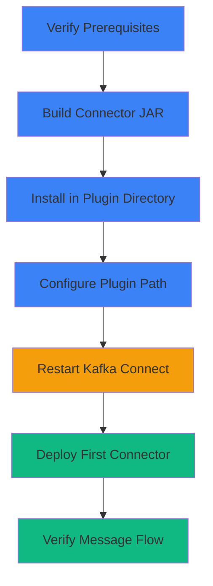

# Getting Started

This guide will help you install, configure, and deploy your first Kafka Connect WebSocket connector in under 30 minutes.

## Overview

The Kafka Connect WebSocket Source Connector enables you to stream real-time data from any WebSocket endpoint directly into Apache Kafka topics. It handles connection management, reconnection logic, and integrates seamlessly with Kafka Connect's distributed architecture.

## What You'll Learn

In this section, you'll learn how to:

1. **[Prerequisites](prerequisites.md)** - Verify your environment has the required dependencies
2. **[Installation](installation.md)** - Install the connector in your Kafka Connect cluster
3. **[Quick Start](quick-start.md)** - Deploy your first connector and verify it's working

## Typical Setup Flow



## Time Estimates

| Task | Estimated Time |
|------|----------------|
| Prerequisites verification | 5 minutes |
| Building from source | 2 minutes |
| Installation & configuration | 10 minutes |
| First connector deployment | 5 minutes |
| Verification & testing | 5 minutes |
| **Total** | **~30 minutes** |

## Deployment Options

Choose the deployment method that best fits your environment:

=== "Distributed Mode (Production)"

    **Best for:**
    - Production deployments
    - High availability requirements
    - Multiple connectors
    - Horizontal scaling

    **Configuration:**
    ```properties
    # config/connect-distributed.properties
    plugin.path=/usr/local/share/kafka/plugins
    ```

    [Learn more about distributed mode →](installation.md#distributed-mode)

=== "Standalone Mode (Development)"

    **Best for:**
    - Local development
    - Testing
    - Single connector instances
    - Quick prototyping

    **Configuration:**
    ```properties
    # config/connect-standalone.properties
    plugin.path=/usr/local/share/kafka/plugins
    ```

    [Learn more about standalone mode →](installation.md#standalone-mode)

## System Requirements

### Minimum Requirements

- **Java**: 11 or higher
- **Kafka**: 3.9.0 or higher
- **Memory**: 512 MB RAM for connector
- **Network**: Access to WebSocket endpoint (outbound connections)

### Recommended for Production

- **Java**: 17 (LTS)
- **Kafka**: Latest stable version
- **Memory**: 2 GB RAM for Kafka Connect worker
- **CPU**: 2+ cores
- **Network**: Low-latency connection to WebSocket server

## Support Matrix

| Component | Minimum Version | Recommended Version | Tested Versions |
|-----------|----------------|---------------------|-----------------|
| Java | 11 | 17 | 11, 17, 21 |
| Kafka | 3.9.0 | 3.9.0+ | 3.9.0 |
| Maven | 3.6+ | 3.9+ | 3.6, 3.8, 3.9 |
| OkHttp | 4.12.0 | 4.12.0 | 4.12.0 |

## Quick Links

<div class="grid cards" markdown>

- :material-download:{ .lg .middle } **[Installation](installation.md)**

    ---

    Step-by-step guide to install the connector in your Kafka Connect cluster.

- :material-rocket-launch:{ .lg .middle } **[Quick Start](quick-start.md)**

    ---

    Deploy your first connector and start streaming WebSocket data.

- :material-cog:{ .lg .middle } **[Configuration](../configuration/index.md)**

    ---

    Complete reference for all configuration parameters.

- :material-help-circle:{ .lg .middle } **[Troubleshooting](../operations/troubleshooting.md)**

    ---

    Common issues and solutions for installation problems.

</div>

## Before You Begin

!!! tip "Check Your Environment"
    Before proceeding, ensure you have:

    - [ ] Java 11+ installed (`java -version`)
    - [ ] Kafka 3.9.0+ running
    - [ ] Access to build the connector (Maven 3.6+)
    - [ ] Network access to your target WebSocket endpoint

!!! warning "Production Considerations"
    For production deployments, review the [Data Reliability](../reliability/index.md) section to understand the connector's at-most-once semantics and data loss scenarios.

## Next Steps

Ready to install? Start with:

1. [Prerequisites](prerequisites.md) - Verify your environment
2. [Installation](installation.md) - Install the connector
3. [Quick Start](quick-start.md) - Deploy your first connector

---

Need help? Check our [FAQ](../faq.md) or [open an issue](https://github.com/conduktor/kafka-connect-websocket/issues).
